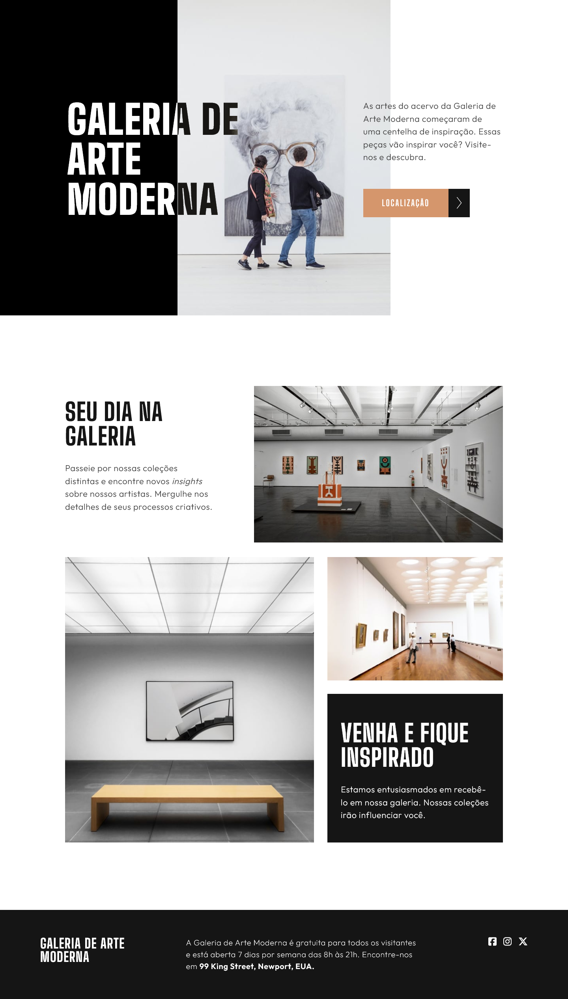

# GALERIA DE ARTE MODERNA

## Conteúdo

- [GALERIA DE ARTE MODERNA](#galeria-de-arte-moderna)
  - [Conteúdo](#conteúdo)
    - [Imagem](#imagem)
    - [Link GitPage](#link-gitpage)
    - [Desenvolvido Com](#desenvolvido-com)

### Imagem

 
  

### Link GitPage

- GitPage: [Galeria de Arte Moderna](https://marcelacostaa.github.io/galeria-moderna/)

### Desenvolvido Com

- HTML5 semântico
- Flexbox
- CSS Grid
- SASS
- Media Queries

Esta é uma solução para [Art gallery website challenge on Frontend Mentor](https://www.frontendmentor.io/challenges/art-gallery-website-yVdrZlxyA).
